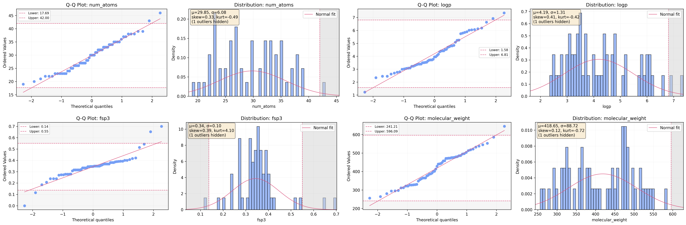

<div align="center">
  

  # MolForge

  **A configurable pipeline for molecular data processing, curation, and conformer generation**

  [](https://github.com/molML/molforge)
  [](LICENSE)

</div>

---

## Overview

MolForge is a configurable pipeline for molecular data processing, curation, and conformer generation. The framework processes molecular data through modular steps including ChEMBL data retrieval, molecule standardization, tokenization, and conformer generation.

---

## Core Features

- **Data Retrieval**: Fetch bioactivity data from ChEMBL (SQL or API backends)
- **Molecule Curation**: Standardize molecules through configurable curation steps
- **SMILES Tokenization**: Convert SMILES strings to token sequences with vocabulary management
- **Property-Based Filtering**: Distribution-based molecular property curation
- **Conformer Generation**: Generate 3D conformer ensembles (RDKit or OpenEye)
- **Plugin System**: Extend functionality with custom actors

---

## Installation

### Standard Installation

```bash
git clone https://github.com/molML/molforge.git
cd molforge
conda env create -f environment.yaml
conda activate molforge
```

### With OpenEye Toolkit

OpenEye Toolkit requires a commercial license. Academic licenses available from [OpenEye Academic Licensing](https://www.eyesopen.com/academic-licensing).

```bash
# Create environment
conda create -n molforge python=3.12
conda activate molforge

# Install OpenEye first
conda install -c openeye openeye-toolkits

# Install remaining dependencies
conda env update -f environment.yaml --prune

# Set license path
export OE_LICENSE=/path/to/oe_license.txt
```

---

## Quick Start

```python
from molforge import MolForge, ForgeParams

# Configure pipeline
params = ForgeParams(
    steps=['source', 'chembl', 'curate'],
    source_params={'backend': 'sql'},
    chembl_params={'standard_type': 'IC50'},
    curate_params={'mol_steps': ['desalt', 'neutralize', 'sanitize']}
)

# Run pipeline
forge = MolForge(params)
df = forge.forge("CHEMBL234")
```

---

## Base Parameters

All actor parameter classes inherit from `BaseParams`, which provides common functionality.

| Parameter | Default | Type | Description |
|-----------|---------|------|-------------|
| `verbose` | `True` | `bool` | Enable verbose logging output |

---

## Pipeline Configuration

The `ForgeParams` class configures the overall pipeline behavior and individual actor parameters.

### Pipeline Parameters

| Parameter | Default | Type | Description |
|-----------|---------|------|-------------|
| `steps` | `['source', 'chembl', 'curate', 'tokens', 'distributions']` | `List[str]` | List of actor steps to execute in order |
| `return_none_on_fail` | `False` | `bool` | Return None instead of raising exception on failure |
| `output_root` | `"MOLFORGE_OUT"` | `str` | Root directory for output files |
| `write_output` | `True` | `bool` | Write pipeline output to disk |
| `write_checkpoints` | `False` | `bool` | Save intermediate results at each step |
| `console_log_level` | `'INFO'` | `str` | Console logging level ('DEBUG', 'INFO', 'WARNING', 'ERROR') |
| `file_log_level` | `'DEBUG'` | `str` | File logging level |
| `override_actor_params` | `True` | `bool` | Use pipeline-level params to override actor params |

### Actor Parameters

Each actor has a corresponding parameter class. Specify actor parameters using the `{actor}_params` attribute:

```python
ForgeParams(
    steps=['source', 'chembl'],
    source_params=ChEMBLSourceParams(backend='sql'),
    chembl_params={'standard_type': 'IC50'}  # Can also use dict
)
```

---

## Actor Reference

### 1. ChEMBLSource (`source`)

Retrieves bioactivity data from ChEMBL database. Supports SQL (local database) and API (web service) backends. SQL backend is significantly faster than API once downloaded (<1s vs. >30s per protein, depending on the target).

#### Shared Parameters

| Parameter | Default | Type | Description |
|-----------|---------|------|-------------|
| `backend` | `'sql'` | `'sql'` \| `'api'` | Data source backend |
| `n` | `1000` | `int` | Number of activity entries to retrieve per query (> 0) |
| `search_all` | `True` | `bool` | Fetch all entries instead of limiting to n |

#### SQL Backend Parameters

| Parameter | Default | Type | Description |
|-----------|---------|------|-------------|
| `db_path` | `None` | `str` \| `None` | Path to local ChEMBL SQLite database |
| `version` | `'latest'` | `str` \| `int` | ChEMBL version (e.g., 36) or 'latest' |
| `auto_download` | `True` | `bool` | Automatically download database if not found |
| `download_dir` | `"./data/chembl"` | `str` | Directory to store downloaded database |

#### API Backend Parameters

API backend currently uses only shared parameters.

#### Example

```python
# SQL backend
source_params = ChEMBLSourceParams(
    backend='sql',
    version=36,
    auto_download=True
)

# API backend
source_params = ChEMBLSourceParams(
    backend='api',
    n=5000,
    search_all=False
)
```

---

### 2. ChEMBLCurator (`chembl`)

Curates ChEMBL bioactivity data with automatic type-driven behavior. Curation logic adapts based on `standard_type` category (potency, kinetic, ADMET, activity).

#### Core Parameters

| Parameter | Default | Type | Description |
|-----------|---------|------|-------------|
| `standard_type` | `'IC50'` | `str` | Measurement type (see supported types below) |
| `standard_units` | `None` | `str` \| `None` | Measurement units (auto-set from type if None) |
| `standard_relation` | `'='` | `'='` \| `'>'` \| `'<'` \| `'>='` \| `'<='` \| `'~'` \| `None` | Relation operator for measurements |
| `assay_type` | `'B'` | `'B'` \| `'F'` \| `'A'` \| `'T'` | Assay type (Binding, Functional, ADMET, Toxicity) |
| `target_organism` | `'Homo sapiens'` | `str` | Target organism for filtering |
| `assay_format` | `'protein'` | `str` | Assay system format (see options below), maps to BAO format and is mostly for readability |

#### Quality Control Parameters

| Parameter | Default | Type | Description |
|-----------|---------|------|-------------|
| `top_n` | `5` | `int` | Number of top-ranked assays to consider per target |
| `mistakes_only` | `True` | `bool` | Only flag suspicious unit conversion errors |
| `error_margin` | `0.0001` | `float` | Tolerance for suspicious pair detection |
| `std_threshold` | `0.5` | `float` | Standard deviation threshold for filtering |
| `range_threshold` | `0.5` | `float` | Range threshold for filtering |

#### Advanced Parameters

| Parameter | Default | Type | Description |
|-----------|---------|------|-------------|
| `mutant_regex` | `'mutant\|mutation\|variant'` | `str` | Regex pattern to identify mutant assays |
| `allosteric_regex` | `'allosteric'` | `str` | Regex pattern to identify allosteric assays |
| `C` | `1e9` | `float` | Conversion constant for molarity (auto-set from units). Only change if you desire non-standard unit conversion |
| `SMILES_column` | `'canonical_smiles'` | `str` | Column name for SMILES strings |
| `bao_format` | Auto-set | `str` | BioAssay Ontology format code (derived from assay_format) |

#### Supported Standard Types

**Potency** (IC50, EC50, AC50, Ki, Kd, XC50)
**Kinetic** (kon, k_off, koff, Kon, Koff)
**ADMET** (Log BB, Log D, Log P, Clearance, T1/2, Solubility, Permeability, Caco-2, MDCK)
**Activity** (Inhibition, Percent Effect, Activity, Potency)

Use `ChEMBLCuratorParams.list_supported_types()` to see all supported types.

#### Assay Format Options

- `'general'` - Unspecified format
- `'protein'` - Single protein format (biochemical)
- `'cell'` - Cell-based format
- `'organism'` - Organism-based format (in vivo)
- `'tissue'` - Tissue-based format (ex vivo)
- `'microsome'` - Microsome format (metabolic stability)

#### Example

```python
# IC50 potency assay
chembl_params = ChEMBLCuratorParams(
    standard_type='IC50',
    standard_units='nM',
    assay_type='B',
    assay_format='protein'
)

# ADMET assay
chembl_params = ChEMBLCuratorParams(
    standard_type='Log BB',
    assay_type='A',
    assay_format='organism',
    target_organism='Mus musculus'
)
```

---

### 3. CurateMol (`curate`)

Standardizes molecules through configurable curation steps including desalting, neutralization, stereochemistry handling, and SMILES canonicalization.

#### Core Parameters

| Parameter | Default | Type | Description |
|-----------|---------|------|-------------|
| `mol_steps` | See below | `List[str]` | Ordered list of molecule curation steps |
| `smiles_steps` | `['canonical', 'kekulize']` | `List[str]` | SMILES processing steps |
| `SMILES_column` | `'canonical_smiles'` | `str` | Column name for SMILES strings |
| `dropna` | `True` | `bool` | Remove molecules with missing SMILES |
| `check_duplicates` | `True` | `bool` | Check for duplicate molecules |
| `duplicates_policy` | `'first'` | `'first'` \| `'last'` \| `False` | How to handle duplicates |

Default `mol_steps`: `['desalt', 'removeIsotope', 'removeHs', 'tautomers', 'neutralize', 'sanitize', 'handleStereo', 'computeProps']`

#### Step-Specific Parameters

| Parameter | Default | Type | Description |
|-----------|---------|------|-------------|
| `neutralize_policy` | `'keep'` | `'keep'` \| `'remove'` | Keep or remove molecules after neutralization failure |
| `desalt_policy` | `'keep'` | `'keep'` \| `'remove'` | Keep or remove molecules after desalting |
| `brute_force_desalt` | `False` | `bool` | Use aggressive SMILES-based desalting for problematic molecules |
| `max_tautomers` | `512` | `int` | Maximum tautomers to enumerate |
| `step_timeout` | `60` | `int` | Timeout in seconds for individual curation steps |

#### Stereochemistry Parameters

| Parameter | Default | Type | Description |
|-----------|---------|------|-------------|
| `stereo_policy` | `'assign'` | `'keep'` \| `'remove'` \| `'assign'` \| `'enumerate'` | Stereochemistry handling strategy |
| `assign_policy` | `'random'` | `'first'` \| `'random'` \| `'lowest'` | Selection strategy for assignment |
| `max_isomers` | `32` | `int` | Maximum stereoisomers to enumerate |
| `try_embedding` | `False` | `bool` | Use 3D embedding for stereocenter assignment |
| `only_unassigned` | `True` | `bool` | Only process unassigned stereocenters |
| `only_unique` | `True` | `bool` | Remove duplicate stereoisomers |
| `random_seed` | `42` | `int` | Random seed for reproducible assignment |

#### Available Curation Steps

**Molecule Steps** (`mol_steps`):
- `'desalt'` - Remove counterions and salts
- `'removeIsotope'` - Remove isotope labels
- `'removeHs'` - Remove explicit hydrogens
- `'tautomers'` - Canonicalize tautomeric form
- `'neutralize'` - Neutralize charged species
- `'sanitize'` - Apply RDKit sanitization
- `'handleStereo'` - Process stereochemistry
- `'computeProps'` - Compute molecular properties

**SMILES Steps** (`smiles_steps`):
- `'canonical'` - Generate canonical SMILES
- `'kekulize'` - Convert to Kekulé form

#### Example

```python
# Standard curation
curate_params = CurateMolParams(
    mol_steps=['desalt', 'neutralize', 'sanitize'],
    stereo_policy='assign',
    dropna=True
)

# Enumerate stereoisomers
curate_params = CurateMolParams(
    mol_steps=['desalt', 'neutralize', 'sanitize', 'handleStereo'],
    stereo_policy='enumerate',
    max_isomers=16
)
```

---

### 4. TokenizeData (`tokens`)

Tokenizes SMILES strings into token sequences for machine learning applications. Supports dynamic vocabulary updating which may be useful for building a single vocabulary across several forge inputs (e.g., an array of protein targets).

#### Parameters

| Parameter | Default | Type | Description |
|-----------|---------|------|-------------|
| `vocab_file` | `None` | `str` \| `None` | Path to existing vocabulary file |
| `SMILES_column` | `'curated_smiles'` | `str` | Column name for SMILES strings |
| `dynamically_update_vocab` | `True` | `bool` | Update vocabulary with new tokens from input |

#### Example

```python
# Dynamic vocabulary
tokens_params = TokenizeDataParams(
    SMILES_column='curated_smiles',
    dynamically_update_vocab=True
)

# Fixed vocabulary
tokens_params = TokenizeDataParams(
    vocab_file='vocab.json',
    dynamically_update_vocab=False
)
```

---

### 5. CurateDistribution (`distributions`)

Filters molecules based on molecular property distributions using statistical or quantile thresholds. A global threshold can be set for all specified properties for easy-of-use. Beware of the fact that distribution thresholds apply to set set of molecules at that stage of the pipeline, these are typically non-normal, low sample size (±1k mols). For large scale curation, it is best to calibrate thresholds on a larger chemical space.

#### Core Parameters

| Parameter | Default | Type | Description |
|-----------|---------|------|-------------|
| `SMILES_column` | `'curated_smiles'` | `str` | Column name for SMILES strings |
| `tokens_column` | `'tokens'` | `str` | Column name for token sequences |
| `properties` | `None` | `List[str]` \| `'all'` \| `None` | Properties to compute (None = auto-detect) |
| `compute_properties` | `True` | `bool` | Compute molecular properties |
| `dropna` | `True` | `bool` | Remove molecules with missing values |

#### Threshold Parameters

| Parameter | Default | Type | Description |
|-----------|---------|------|-------------|
| `thresholds` | `{}` | `Dict[str, PropertyThreshold]` | Property-specific threshold configurations |
| `global_statistical_threshold` | `None` | `float` \| `None` | Global statistical threshold (e.g., 2.0 for ±2σ) |
| `global_quantile_threshold` | `None` | `float` \| `None` | Global quantile threshold (e.g., 0.025 for 2.5%-97.5%) |

#### Token Curation Parameters

| Parameter | Default | Type | Description |
|-----------|---------|------|-------------|
| `curate_tokens` | `True` | `bool` | Enable token-based filtering |
| `filter_unknown_tokens` | `True` | `bool` | Remove molecules with unknown tokens |
| `token_frequency_threshold` | `None` | `float` \| `None` | Minimum token frequency percentage (0-100) |

#### Visualization Parameters

| Parameter | Default | Type | Description |
|-----------|---------|------|-------------|
| `plot_distributions` | `True` | `bool` | Generate distribution plots |
| `perform_pca` | `False` | `bool` | Perform PCA analysis on properties |

#### Available Properties

`num_atoms`, `num_rings`, `size_largest_ring`, `num_tokens`, `tokens_atom_ratio`, `c_atom_ratio`, `longest_aliph_c_chain`, `molecular_weight`, `logp`, `tpsa`, `num_rotatable_bonds`, `num_h_donors`, `num_h_acceptors`, `fsp3`, `num_aromatic_rings`, `num_stereocenters`, `num_heteroatoms`, `heteroatom_ratio`

#### PropertyThreshold Configuration

`PropertyThreshold` supports three types of thresholds (priority: absolute > statistical > quantile):

| Parameter | Type | Description |
|-----------|------|-------------|
| `min_value` | `float` \| `None` | Absolute minimum value |
| `max_value` | `float` \| `None` | Absolute maximum value |
| `statistical_lower` | `float` \| `None` | Lower bound as mean - n×std (e.g., -2.0) |
| `statistical_upper` | `float` \| `None` | Upper bound as mean + n×std (e.g., 2.0) |
| `quantile_lower` | `float` \| `None` | Lower percentile (0-1, e.g., 0.025) |
| `quantile_upper` | `float` \| `None` | Upper percentile (0-1, e.g., 0.975) |

#### Example

```python
from molforge import PropertyThreshold

# Global statistical threshold
distributions_params = CurateDistributionParams(
    global_statistical_threshold=2.0,  # ±2σ
    plot_distributions=True
)

# Property-specific thresholds
distributions_params = CurateDistributionParams(
    thresholds={
        'molecular_weight': PropertyThreshold(min_value=200, max_value=500),
        'logp': PropertyThreshold(statistical_lower=-2.0, statistical_upper=2.0),
        'num_atoms': PropertyThreshold(quantile_lower=0.05, quantile_upper=0.95)
    }
)
```

---

### 6. GenerateConfs (`confs`)

Generates 3D conformer ensembles for molecules. Supports RDKit and OpenEye backends with backend-specific optimization parameters.

#### Shared Parameters

| Parameter | Default | Type | Description |
|-----------|---------|------|-------------|
| `backend` | `'rdkit'` | `'rdkit'` \| `'openeye'` | Conformer generation backend |
| `max_confs` | `200` | `int` | Maximum conformers to generate per molecule (> 0) |
| `rms_threshold` | `0.5` | `float` | RMS threshold for conformer pruning in Angstroms (> 0) |
| `SMILES_column` | `'curated_smiles'` | `str` | Column name for SMILES strings |
| `names_column` | `'molecule_chembl_id'` | `str` | Column name for molecule identifiers |
| `dropna` | `True` | `bool` | do not attempt generation for invalid SMILES or molecules |

#### RDKit Backend Parameters

| Parameter | Default | Type | Description |
|-----------|---------|------|-------------|
| `use_random_coords` | `True` | `bool` | Use random coordinates for initial embedding |
| `random_seed` | `42` | `int` | Random seed for reproducibility (≥ 0) |
| `num_threads` | `0` | `int` | Number of threads (0 = all available cores) |
| `use_uff` | `True` | `bool` | Use UFF force field for optimization |
| `max_iterations` | `200` | `int` | Maximum optimization iterations per conformer (> 0) |

#### OpenEye Backend Parameters

| Parameter | Default | Type | Description |
|-----------|---------|------|-------------|
| `mode` | `'classic'` | `str` | OMEGA generation mode (see options below) |
| `use_gpu` | `True` | `bool` | Enable GPU acceleration if available |
| `mpi_np` | `-1` | `int` | Number of MPI processes (-1 = auto-detect) |
| `strict` | `True` | `bool` | Use strict generation mode, fails SMILES with unassigned stereocenters |
| `flipper` | `False` | `bool` | Enable stereocenter flipping for unassigned stereocenters |
| `flipper_warts` | `False` | `bool` | Add suffix to flipped stereoisomers names (may cause issues for downstream tasks) |
| `flipper_maxcenters` | `4` | `int` | Maximum stereocenters to enumerate with flipper (> 0) |
| `oeomega_path` | `None` | `str` \| `None` | Path to OMEGA executable (None = auto-detect) |

#### OpenEye OMEGA Modes

- `'classic'` - Standard conformer generation, use this if unsure
- `'macrocycle'` - Optimized for macrocyclic molecules
- `'rocs'` - Optimized for ROCS overlay applications
- `'pose'` - Optimized for docking pose generation
- `'dense'` - Dense conformer sampling
- `'fastrocs'` - Fast ROCS-ready generation

#### Example

```python
# RDKit backend
confs_params = GenerateConfsParams(
    backend='rdkit',
    max_confs=200,
    rms_threshold=0.5,
    use_uff=True
)

# OpenEye backend
confs_params = GenerateConfsParams(
    backend='openeye',
    max_confs=500,
    mode='classic',
    use_gpu=True
)

# OpenEye for macrocycles
confs_params = GenerateConfsParams(
    backend='openeye',
    mode='macrocycle',
    max_confs=300,
    flipper=True
)
```

---

## Plugin Development

MolForge supports custom plugin actors for extending the pipeline with domain-specific functionality. Plugins are automatically discovered and integrate seamlessly with the core framework.

### Quick Start

Custom actors are placed in `molforge/actor_plugins/` and automatically loaded at runtime. Each plugin consists of a parameter class and an actor class:

```python
from dataclasses import dataclass
from molforge.actors.base import BaseActor
from molforge.actors.params.base import BaseParams

@dataclass
class MyPluginParams(BaseParams):
    my_parameter: str = 'default_value'

class MyPlugin(BaseActor):
    __step_name__ = 'my_plugin'  # Used in pipeline configuration
    __param_class__ = MyPluginParams

    def process(self, data):
        # Your processing logic here
        return data
```

### Using Plugins in Pipelines

Reference plugins by their `__step_name__` in the pipeline steps, and configure them using `plugin_params`:

```python
from molforge import MolForge, ForgeParams

params = ForgeParams(
    steps=['source', 'chembl', 'curate', 'my_plugin'],  # Add plugin to steps
    plugin_params={
        'my_plugin': MyPluginParams(
            my_parameter='custom_value'
        )
    }
)

forge = MolForge(params)
df = forge.forge("CHEMBL234")
```

### Common Patterns

#### Input and Output Specification

Declare required input columns and output columns for pipeline validation:

```python
class MyPlugin(BaseActor):
    @property
    def required_columns(self):
        return ['curated_smiles']  # Columns needed from previous actors

    @property
    def output_columns(self):
        return ['my_property']  # Columns added by this actor
```

#### Handling Optional Dependencies

Use graceful error handling for optional dependencies:

```python
@dataclass
class MyPluginParams(BaseParams):
    def _validate_params(self):
        try:
            import optional_library
        except ImportError:
            raise ImportError(
                "optional_library required. Install with: pip install optional_library"
            )
```

#### Pipeline Logging

Use `self.log()` for consistent logging integration:

```python
def process(self, data):
    self.log(f"Processing {len(data)} molecules")
    # ... processing logic ...
    self.log(f"Completed processing", level='DEBUG')
    return data
```

### Testing Plugins

Test plugins standalone before pipeline integration:

```python
import pandas as pd

# Create test data
test_data = pd.DataFrame({
    'curated_smiles': ['CCO', 'c1ccccc1', 'CC(=O)O']
})

# Initialize and test
params = MyPluginParams(my_parameter='test_value')
plugin = MyPlugin(params)
result = plugin.process(test_data)

print(result)
```

### Complete Example

See `molforge/actor_plugins/example.py` for a fully documented plugin template covering:
- Parameter validation with `_validate_params()`
- Actor initialization with `__post_init__()`
- Robust error handling for individual molecules
- Custom metadata in `_create_output()`
- Integration with pipeline configuration

The example plugin demonstrates calculating molecular descriptors with RDKit and serves as a reference for all plugin patterns.

---

## Complete Pipeline Example

```python
from molforge import MolForge, ForgeParams

# Configure complete pipeline
params = ForgeParams(
    steps=['source', 'chembl', 'curate', 'tokens', 'distributions', 'confs'],

    # Data retrieval
    source_params={'backend': 'sql', 'version': 36},

    # ChEMBL curation
    chembl_params={
        'standard_type': 'IC50',
        'standard_units': 'nM',
        'assay_type': 'B',
        'assay_format': 'protein'
    },

    # Molecule standardization
    curate_params={
        'mol_steps': ['desalt', 'neutralize', 'sanitize', 'handleStereo'],
        'stereo_policy': 'assign',
        'dropna': True
    },

    # Tokenization
    tokens_params={
        'dynamically_update_vocab': True
    },

    # Property filtering
    distributions_params={
        'global_statistical_threshold': 2.0,
        'plot_distributions': True
    },

    # Conformer generation
    confs_params={
        'backend': 'rdkit',
        'max_confs': 200,
        'rms_threshold': 0.5
    }
)

# Execute pipeline
forge = MolForge(params)
df = forge.forge("CHEMBL234")
print(f"Processed {len(df)} molecules")
```

---

## Example Output

Running the complete pipeline example above generates organized output with logs, data, and visualizations:

### Output Structure

```text
MOLFORGE_OUT/CHEMBL234_ID60ef8cb9/
├── CHEMBL234_ID60ef8cb9.csv          # Final curated dataset
├── CHEMBL234_ID60ef8cb9.log          # Execution log
├── CHEMBL234_ID60ef8cb9_config.json  # Pipeline configuration
├── curation_results.json             # Metadata and statistics
├── vocab.json                        # SMILES vocabulary
├── vocab_curated.json                # Post-curation vocabulary
└── distributions/                     # Property distribution plots
    ├── molecular_weight.png
    ├── logp.png
    ├── num_atoms.png
    ├── fsp3.png
    └── ... (18 property plots)
```

### Distribution Analysis

The pipeline automatically generates distribution plots for molecular properties, helping identify outliers and validate filtering thresholds:



<details>
<summary>📋 View execution log excerpt</summary>

```log
2025-12-15 17:56:53 | [  PIPELINE   ] | INFO | Starting pipe.
2025-12-15 17:56:54 | [     SQL     ] | INFO | Total entries available: 20595
2025-12-15 17:56:54 | [     SQL     ] | INFO | Fetching all 20595 entries...
2025-12-15 17:56:54 | [   CHEMBL    ] | INFO | Conditional curation: 65/20595.
2025-12-15 17:56:54 | [   CHEMBL    ] | INFO | Standardization: IC50 → pIC50 (log10 conversion).
2025-12-15 17:56:54 | [   CHEMBL    ] | INFO | Aggregated 0 duplicate SMILES entries. Final: 61/65 rows.
2025-12-15 17:56:54 | [   CURATE    ] | INFO | Molecular curation: 61/61 successful. drop_na=True
2025-12-15 17:56:55 | [   TOKENS    ] | INFO | Tokenized 58 SMILES (58 valid, 0 invalid).
2025-12-15 17:57:00 | [DISTRIBUTIONS] | INFO | Distribution filters: 42/59 molecules retained (17 removed, 71.2% pass rate).
2025-12-15 17:57:00 | [  CONFS-RDK  ] | INFO | Generating conformers for 42 SMILES
2025-12-15 17:57:49 | [     RDK     ] | INFO | RDKit generation complete: 42/42 succeeded
2025-12-15 17:57:49 | [  CONFS-RDK  ] | INFO | Conformer generation complete: avg 121.0 conformers/molecule
2025-12-15 17:57:49 | [  PIPELINE   ] | INFO | Pipeline completed | Total time: 55.15s
```

</details>

---

## Command Line Interface

```bash
# Run pipeline with configuration file
molforge run CHEMBL234 --config config.yaml

# Get actor information
molforge info actors

# Show architecture
molforge info architecture
```

---

## Contributing

This is a public beta release. Contributions welcome through [GitHub Issues](https://github.com/molML/molforge/issues).

## License

MIT License
