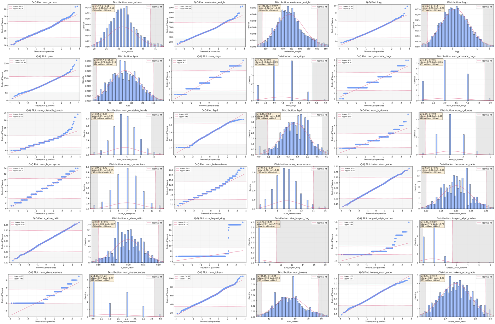
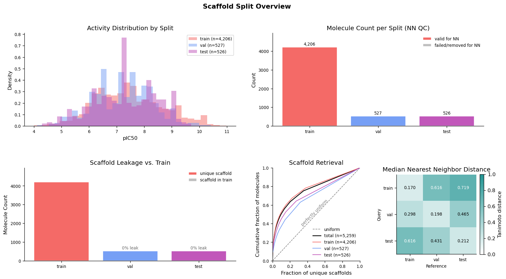

# Example Run: JAK2 (CHEMBL2971) IC50 Pipeline

[← Back to README](../README.md) · [Documentation index](../README.md#documentation)

The `demo/` directory contains a full end-to-end run against JAK2 (ChEMBL target `CHEMBL2971`), exercising curation, tokenization, distribution filtering, OpenEye conformer generation, and the [`scaffold` + `split` demo plugins](plugins.md#included-plugins).

## Input Configuration (`demo/jak2_ic50.yaml`)

```yaml
# MolForge demo: JAK2 (CHEMBL2971) IC50 pipeline
# Full pipeline showcasing curation, tokenization, distribution filtering,
# OpenEye conformer generation, and the scaffold + split demo plugins.
version: "1.0"

steps:
  - source
  - chembl
  - curate
  - tokens
  - distributions
  - confs
  - scaffold
  - split

source:
  backend: sql
  version: 36
  auto_download: false

chembl:
  standard_type: IC50
  standard_units: nM
  standard_relation: "="
  assay_type: B
  target_organism: Homo sapiens
  assay_format: protein
  std_threshold: 0.5
  range_threshold: 0.5

curate:
  mol_steps: [desalt, removeIsotope, neutralize, sanitize, handleStereo]
  smiles_steps: [canonical]
  stereo_policy: assign
  dropna: true

tokens:
  dynamically_update_vocab: true

distributions:
  properties: all
  global_statistical_threshold: 2.0
  curate_tokens: true
  filter_unknown_tokens: true
  plot_distributions: true

confs:
  backend: openeye
  max_confs: 100
  mode: classic

scaffold:
  include_generic: true

split:
  test_ratio: 0.1
  val_ratio: 0.1

output:
  dir: demo
```

The `split` step runs last and partitions the final dataset into train, validation, and test sets.

Run it with:

```bash
molforge run CHEMBL2971 --config demo/jak2_ic50.yaml
```

See the [CLI reference](cli.md) for the `molforge run` options and the [Python API](python-api.md) for the equivalent programmatic entry point.

## Pipeline Flow (actual run)

| Step | In → Out | Notes |
|------|----------|-------|
| [`source`](actors/source.md) | — → **56,207** | Raw JAK2 activities fetched from the local ChEMBL 36 database |
| [`chembl`](actors/chembl.md) | 56,207 → **8,060** | IC50 / binding / protein-format curation, IC50 → pIC50 |
| [`curate`](actors/curate.md) | 8,060 → **7,970** | Desalt, neutralize, sanitize, stereo assignment |
| [`tokens`](actors/tokens.md) | 7,970 → **7,970** | 48-token vocabulary built |
| [`distributions`](actors/distributions.md) | 7,970 → **5,292** | 2,678 removed (66.4% overall pass rate, ±2σ) |
| [`confs`](actors/confs.md) | 5,292 → **5,259** | OpenEye OMEGA, 33 failed, avg ~93 conformers/molecule |
| [`scaffold`](plugins.md#scaffold--bemis-murcko-scaffolds-scaffoldpy) | 5,259 → **5,259** | 2,018 scaffold clusters |
| [`split`](plugins.md#split--trainvaltest-split-splitpy) | 5,259 → **5,259** | train=**4,206**, val=**527**, test=**526** |

Total wall-clock time: **~1m 55s**.

## Distribution Analysis

The pipeline generates a distribution plot for each of the 18 molecular properties, helping identify outliers and validate filtering thresholds:



## Scaffold Split Report

The [`split` plugin](plugins.md#split--trainvaltest-split-splitpy) writes a report card summarising split composition, scaffold statistics, and structural separation (the nearest-neighbour ECFP4 Tanimoto distance matrix):



## Output Structure

A run writes a self-contained directory under the configured output root. The final curated dataset is `CHEMBL2971_ID*.csv`; the run's resolved configuration, logs, vocabularies, split report, distribution plots, and conformers accompany it:

```text
demo/CHEMBL2971_ID3B9CE574/
├── CHEMBL2971_ID3B9CE574.csv          # Final curated dataset
├── CHEMBL2971_ID3B9CE574.log          # Execution log
├── CHEMBL2971_ID3B9CE574_config.json  # Resolved pipeline configuration
├── curation_results.json              # Distribution curation metadata & statistics
├── vocab.json                         # SMILES vocabulary
├── vocab_curated.json                 # Post-curation vocabulary
├── split_report.json                  # Scaffold-split report card
├── split_report.png                   # Scaffold-split report figure
├── distributions/                     # 18 property distribution plots
│   ├── molecular_weight.png
│   ├── logp.png
│   ├── longest_aliph_carbon.png
│   └── ... (18 property plots)
└── conformers/                        # OpenEye OMEGA conformer output (.oeb, logs)
```

Key result files:

- `CHEMBL2971_ID*.csv` — the final curated dataset (one row per molecule, with tokens, properties, `distribution_success`/`distribution_failures`, `scaffold_smiles`, and `split` columns).
- `vocab.json` / `vocab_curated.json` — the base and curated vocabularies (see [Vocabulary handling](actors/distributions.md#vocabulary-handling)).
- `split_report.json` / `split_report.png` — the split report card and figure.
- `distributions/` — one PNG per molecular property.
- `conformers/` — the OpenEye OMEGA conformer output.

<details>
<summary>View trimmed execution log</summary>

```log
2026-07-08 15:31:14 | [  3B9CE574   ] | INFO | Starting pipe.
2026-07-08 15:31:14 | [  3B9CE574   ] | INFO | Input (CHEMBL2971): ChEMBL ID from ChEMBL ID: CHEMBL2971 (0 rows)
2026-07-08 15:31:14 | [  3B9CE574   ] | INFO | [1/8] Starting source.
2026-07-08 15:31:14 | [     SQL     ] | INFO |
==================================================
|   Fetching activity data for CHEMBL2971
|   Database: ./data/chembl/36.db
==================================================
2026-07-08 15:31:14 | [     SQL     ] | INFO | Total entries available: 56207
2026-07-08 15:31:15 | [     SQL     ] | INFO | 56207 entries retrieved.
2026-07-08 15:31:15 | [  3B9CE574   ] | INFO | [1/8] Finished source | success | 56207 rows | 0.86s

2026-07-08 15:31:15 | [  3B9CE574   ] | INFO | [2/8] Starting chembl.
2026-07-08 15:31:15 | [   CHEMBL    ] | INFO | RAW | Configured curation is optimal for CHEMBL2971.
2026-07-08 15:31:15 | [   CHEMBL    ] | INFO | RAW
| standard_type | assay_type | target_organism | bao_format  | assay_format | entries     |  % |
|:--------------|:-----------|:----------------|:------------|:-------------|:------------|---:|
| IC50          | B          | Homo sapiens    | BAO_0000357 | protein      | 14859/56207 | 26 |
| k_off         | B          | Homo sapiens    | BAO_0000357 | protein      | 11913/56207 | 21 |
| kon           | B          | Homo sapiens    | BAO_0000357 | protein      | 11913/56207 | 21 |
| Ki            | B          | Homo sapiens    | BAO_0000357 | protein      | 3704/56207  |  7 |
| IC50          | B          | Homo sapiens    | BAO_0000219 | cell         | 2605/56207  |  5 |
2026-07-08 15:31:15 | [   CHEMBL    ] | INFO | VALID
| standard_type | assay_type | target_organism | bao_format  | assay_format | entries    |  % |
|:--------------|:-----------|:----------------|:------------|:-------------|:-----------|---:|
| IC50          | B          | Homo sapiens    | BAO_0000357 | protein      | 9646/14577 | 66 |
| Ki            | B          | Homo sapiens    | BAO_0000357 | protein      | 2120/14577 | 15 |
| IC50          | B          | Homo sapiens    | BAO_0000219 | cell         | 1217/14577 |  8 |
2026-07-08 15:31:16 | [   CHEMBL    ] | INFO | Conditional curation: 9642/56207.
2026-07-08 15:31:16 | [   CHEMBL    ] | INFO | Standardization: IC50 → pIC50 (log10 conversion).
2026-07-08 15:31:16 | [   CHEMBL    ] | WARNING | 25 suspicious SMILES detected. mistakes_only=True, error_margin=0.0001
2026-07-08 15:31:24 | [   CHEMBL    ] | INFO | Removed 398 (canonical) SMILES entries with std > 0.5 or range > 0.5.
2026-07-08 15:31:24 | [   CHEMBL    ] | INFO | Aggregated 530 duplicate SMILES entries. Final: 8060/9592 rows.
2026-07-08 15:31:25 | [  3B9CE574   ] | INFO | [2/8] Finished chembl | success | 8060 rows | 9.53s

2026-07-08 15:31:25 | [  3B9CE574   ] | INFO | [3/8] Starting curate.
2026-07-08 15:31:25 | [   CURATE    ] | INFO | Processing 8,060 molecules with 19 processes (19 chunks of 425).
2026-07-08 15:31:25 | [   CURATE    ] | INFO | Molecular curation: 8052/8060 successful. drop_na=True
2026-07-08 15:31:28 | [   CHEMBL    ] | INFO | Aggregated 42 duplicate SMILES entries. Final: 7970/8052 rows.
2026-07-08 15:31:28 | [  3B9CE574   ] | INFO | [3/8] Finished curate | success | 7970 rows | 3.77s

2026-07-08 15:31:28 | [  3B9CE574   ] | INFO | [4/8] Starting tokens.
2026-07-08 15:31:28 | [   TOKENS    ] | INFO | Vocabulary constructed: 48 tokens
2026-07-08 15:31:28 | [   TOKENS    ] | INFO | Tokenized 7970 sequences.
2026-07-08 15:31:28 | [  3B9CE574   ] | INFO | [4/8] Finished tokens | success | 7970 rows | 0.04s

2026-07-08 15:31:28 | [  3B9CE574   ] | INFO | [5/8] Starting distributions.
2026-07-08 15:31:29 | [DISTRIBUTIONS] | INFO | INITIAL DISTRIBUTION
| property             | count |   mean |   std |    min |    max | symmetric | normal |
|:---------------------|------:|-------:|------:|-------:|-------:|:----------|:-------|
| num_atoms            |  7970 |  31.69 |  5.61 |  11    |  64    | ✓         | ✗      |
| num_rings            |  7970 |   4.42 |  0.90 |   2    |   8    | ✓         | ✗      |
| size_largest_ring    |  7970 |   6.21 |  1.49 |   6    |  19    | ✗         | ✗      |
| num_tokens           |  7970 |  56.16 | 10.84 |  19    | 105    | ✓         | ✗      |
| longest_aliph_carbon |  7970 |   0.83 |  0.90 |   0    |  10    | ✗         | ✗      |
| molecular_weight     |  7970 | 440.25 | 80.07 | 160.18 | 927.92 | ✓         | ✗      |
| logp                 |  7970 |   3.22 |  1.13 |  -0.40 |   9.88 | ✓         | ✗      |
| tpsa                 |  7970 | 108.57 | 26.20 |  13.59 | 271.58 | ✓         | ✗      |
| ... (18 properties)  |       |        |       |        |        |           |        |
2026-07-08 15:32:03 | [DISTRIBUTIONS] | INFO | FILTER RESULTS
| property             | passed    | removed | pass_rate | thresholds                        |
|:---------------------|:----------|--------:|:----------|:----------------------------------|
| num_h_donors         | 7340/7970 |     630 | 92.1%     | ≥μ-2.0σ (0.23) , ≤μ+2.0σ (3.95)   |
| num_atoms            | 7535/7970 |     435 | 94.5%     | ≥μ-2.0σ (20.47), ≤μ+2.0σ (42.91)  |
| molecular_weight     | 7558/7970 |     412 | 94.8%     | ≥μ-2.0σ (280.11), ≤μ+2.0σ (600.39)|
| logp                 | 7627/7970 |     343 | 95.7%     | ≥μ-2.0σ (0.96) , ≤μ+2.0σ (5.48)   |
| longest_aliph_carbon | 7747/7970 |     223 | 97.2%     | ≥μ-2.0σ (-0.97), ≤μ+2.0σ (2.63)   |
| size_largest_ring    | 7844/7970 |     126 | 98.4%     | ≥μ-2.0σ (3.23) , ≤μ+2.0σ (9.19)   |
2026-07-08 15:32:03 | [DISTRIBUTIONS] | INFO | Distribution curation: 7970 → 5292 retained (removed 2678, 33.6%)  |  property 2678, token 0
2026-07-08 15:32:03 | [  3B9CE574   ] | INFO | [5/8] Finished distributions | success | 5292 rows | 34.72s

2026-07-08 15:32:03 | [  3B9CE574   ] | INFO | [6/8] Starting confs.
2026-07-08 15:32:03 | [     OEO     ] | INFO | Starting OMEGA generation for 5292 SMILES
2026-07-08 15:32:31 | [     OEO     ] | INFO | Progress: 2074/5292 (39.2%) | Rate: 73.61 mol/s | ETA: 43.7s
2026-07-08 15:33:05 | [     OEO     ] | INFO | Progress: 5292/5292 (100.0%) | Rate: 85.49 mol/s | Elapsed: 1.0m
2026-07-08 15:33:06 | [     OEO     ] | INFO | OMEGA generation complete: 5259/5292 succeeded
2026-07-08 15:33:06 | [  CONFS-OEO  ] | INFO | Conformer generation complete: 5259 succeeded, 33 failed, avg 92.8 conformers/molecule
2026-07-08 15:33:06 | [  CONFS-OEO  ] | WARNING | Failure summary:
| Status                                             | count |
|:---------------------------------------------------|------:|
| Failed due to unspecified stereochemistry          |     6 |
| Failed to build structure from CT                  |    22 |
| Force field setup failed due to missing parameters |     5 |
2026-07-08 15:33:06 | [  3B9CE574   ] | INFO | [6/8] Finished confs | success | 5259 rows | 1m 3.3s

2026-07-08 15:33:06 | [  3B9CE574   ] | INFO | [7/8] Starting scaffold.
2026-07-08 15:33:07 | [  SCAFFOLD   ] | INFO | Scaffold computation: 5259/5259 succeeded (0 acyclic, 0 failed).
2026-07-08 15:33:07 | [  3B9CE574   ] | INFO | [7/8] Finished scaffold | success | 5259 rows | 0.51s

2026-07-08 15:33:07 | [  3B9CE574   ] | INFO | [8/8] Starting split.
2026-07-08 15:33:07 | [    SPLIT    ] | INFO | Splitter (unit=scaffold, method=isolation): 5,259 molecules → 10% test / 10% val / 80% train.
2026-07-08 15:33:07 | [    SPLIT    ] | INFO |   2,018 scaffold units (0 rows → train unconditionally).
2026-07-08 15:33:07 | [    SPLIT    ] | INFO |   Isolation scores computed for 2,018 units in 0.09s.
2026-07-08 15:33:07 | [    SPLIT    ] | INFO |   Split: train=4,206  val=527  test=526
2026-07-08 15:33:08 | [    SPLIT    ] | INFO |
  ── Split Summary ──
|             |    train |     val |    test |
|:------------|---------:|--------:|--------:|
| n_molecules | 4206.000 | 527.000 | 526.000 |
| fraction    |    0.800 |   0.100 |   0.100 |
| n_scaffolds | 1474.000 | 286.000 | 258.000 |
| entropy     |    0.885 |   0.922 |   0.888 |

  ── NN Tanimoto Distance (mol-level, median) ──
| query \ ref   |   train |   val |   test |
|:--------------|--------:|------:|-------:|
| train         |   0.17  | 0.616 |  0.719 |
| val           |   0.298 | 0.198 |  0.465 |
| test          |   0.616 | 0.431 |  0.212 |
2026-07-08 15:33:10 | [    SPLIT    ] | INFO | [8/8] Finished split | success | 5259 rows | 2.70s
2026-07-08 15:33:10 | [  3B9CE574   ] | INFO | [8/8] Pipeline completed | Total time: 1m 55.4s
```

</details>

## Related

- [Pipeline Configuration](configuration.md)
- [Command-Line Interface](cli.md)
- [Python API](python-api.md)
- [Plugin Development](plugins.md) — the `scaffold` and `split` plugins used here
